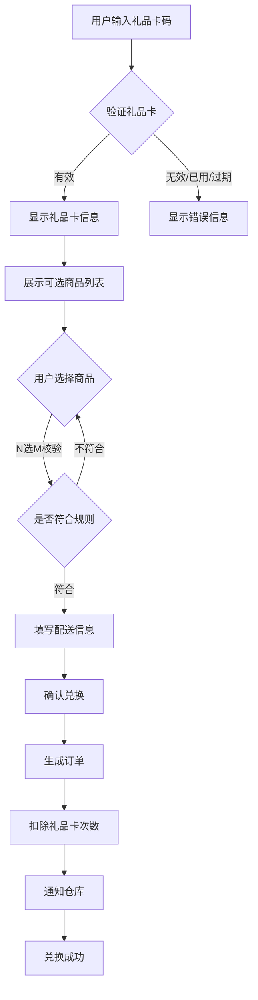
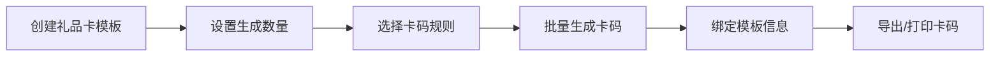
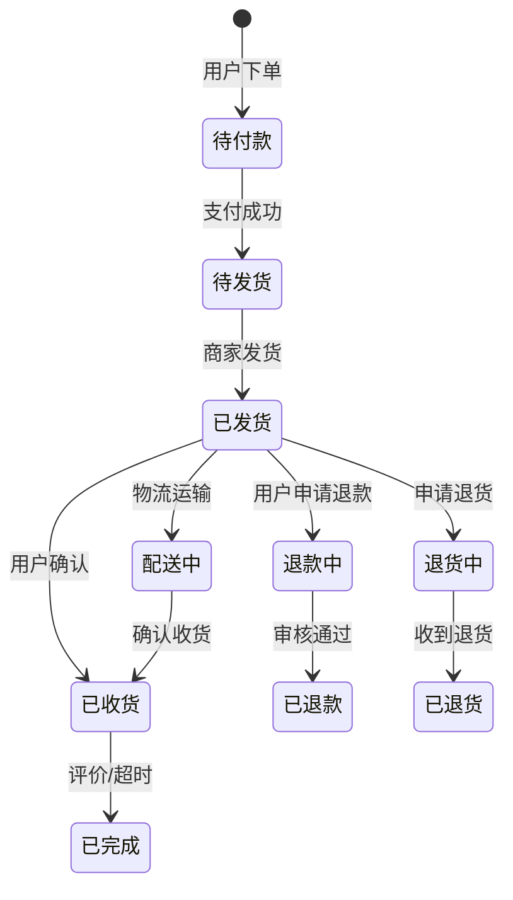

# 礼品卡兑换系统 - 产品需求文档

## 1. 产品概述

礼品卡兑换系统是一套完整的B2C礼品卡在线兑换平台。用户持有礼品卡，可通过输入卡码兑换礼品卡内含的固定商品组合（N选M模式），支持多种配送方式。系统提供完善的管理后台，支持礼品卡分类管理、卡码生成、商品维护、订单管理和物流管理。

### 目标用户
- **C端用户**: 持有礼品卡码的消费者，在线兑换礼品卡商品
- **B端管理员**: 平台运营人员，负责礼品卡和商品管理

### 核心价值
- N选M商品模式，提供灵活的礼品选择
- 完整的订单和物流管理
- 安全可靠的兑换流程

---

## 2. 用户角色

| 角色 | 注册方式 | 核心权限 |
|------|----------|----------|
| 普通用户 | 邮箱注册/手机号 | 兑换礼品卡、选择商品、查看订单、物流跟踪 |
| 管理员 | 后台账号 | 全系统管理权限 |

---

## 3. 功能模块

### 3.1 C端用户模块

1. **首页**
   - 礼品卡兑换入口
   - 用户余额/积分展示
   - 热门商品推荐
   - 兑换记录快捷入口

2. **礼品卡兑换页**
   - 礼品卡码输入与验证
   - 礼品卡信息展示（有效期、所属分类、可选商品）
   - 商品选择界面（N选M选择器）
   - 配送方式选择
   - 收货地址填写
   - 兑换确认与结果反馈

3. **用户中心**
   - 账户信息管理
   - 收货地址管理
   - 兑换历史
   - 物流查询

4. **商品详情页**
   - 商品图片与描述
   - 库存状态
   - 选择规格（如有）

### 3.2 B端管理后台

1. **仪表盘**
   - 今日订单统计
   - 待处理订单数量
   - 销售额概览
   - 库存预警

2. **礼品卡分类管理**
   - 添加/编辑/删除分类
   - 分类名称、图标、排序
   - 分类状态启用/禁用

3. **礼品卡模板管理**
   - 创建礼品卡模板（名称、分类、有效期、价格）
   - 批量生成卡码
   - 卡码导出（Excel）
   - 卡码状态管理（未激活/已激活/已使用/已过期）

4. **商品管理**
   - 添加/编辑/删除商品
   - 商品分类
   - 商品图片上传
   - 库存管理
   - 规格属性设置
   - 上架/下架

5. **礼品卡商品关联**
   - 为礼品卡模板配置可选商品
   - 设置N选M数量限制
   - 设置每件商品可选数量

6. **订单管理**
   - 订单列表（多状态筛选）
   - 订单详情
   - 订单状态更新
   - 退款/退货处理

7. **物流管理**
   - 物流公司维护
   - 物流单号录入
   - 批量发货
   - 物流信息查询
   - 电子面单打印

---

## 4. 核心流程

### 4.1 礼品卡兑换流程

### 4.2 N选M模式说明

- **N**: 礼品卡关联的总商品数量
- **M**: 用户必须选择的商品数量
- 示例: 礼品卡关联10件商品，用户需选择其中3件

### 4.3 后台卡码生成流程

---

## 5. 商品与分类

### 5.1 商品分类

| 一级分类 | 二级分类示例 |
|---------|-------------|
| 数码电子 | 手机配件、影音娱乐、智能家居 |
| 时尚生活 | 服装配饰、美妆护肤、家居日用 |
| 食品保健 | 零食饮料、营养保健品 |
| 礼品套装 | 节日礼盒、品牌套装 |

### 5.2 礼品卡分类

| 分类名称 | 面额范围 | 典型商品数 |
|---------|----------|------------|
| 入门卡 | 100-300 | 5-10件 |
| 标准卡 | 300-800 | 10-20件 |
| 尊享卡 | 800-2000 | 20-50件 |
| 定制卡 | 自定义 | 自定义 |

---

## 6. 用户界面设计

### 6.1 设计风格

- **主题**: 现代轻奢商务风，香槟金点缀体现品质感
- **主色调**: 深邃藏蓝 #1a1f36 搭配香槟金 #d4af37
- **辅助色**:
  - 纯白 #ffffff
  - 浅灰背景 #f5f6f8
  - 成功绿 #10b981
  - 警告橙 #f59e0b
  - 错误红 #ef4444
- **字体**:
  - 标题: Playfair Display (衬线体，优雅)
  - 正文: Noto Sans SC (无衬线，清晰)
- **按钮风格**: 圆角矩形，金色渐变按钮，悬停微光
- **图标**: Lucide Icons，1.5px线宽
- **布局**: 卡片式布局，清晰的信息层级

### 6.2 C端页面设计

| 页面 | 模块 | UI元素 |
|------|------|--------|
| 首页 | 余额卡片 | 玻璃拟态背景，金色数字 |
| 首页 | 兑换入口 | 大号输入框 + 立即兑换按钮 |
| 首页 | 商品推荐 | 网格卡片，阴影效果 |
| 兑换页 | 卡券信息 | 礼品卡样式，状态标识 |
| 兑换页 | 商品选择器 | N选M网格，支持多选 |
| 兑换页 | 配送表单 | 地址选择 + 物流选择 |
| 个人中心 | 账户概览 | 头像、昵称、快捷操作 |
| 个人中心 | 订单列表 | 状态标签，时间线 |

### 6.3 后台页面设计

| 页面 | 模块 | 功能 |
|------|------|------|
| 仪表盘 | 数据卡片 | 统计数字、环比趋势 |
| 仪表盘 | 待办事项 | 快捷处理入口 |
| 分类管理 | 树形表格 | 分类增删改，拖拽排序 |
| 卡码管理 | 数据表格 | 分页、筛选、批量操作 |
| 卡码管理 | 生成弹窗 | 数量、规则、前缀设置 |
| 商品管理 | 商品列表 | 表格+图片预览 |
| 商品管理 | 商品编辑 | 表单+图片上传 |
| 订单管理 | 订单表格 | 状态筛选，订单详情 |
| 订单管理 | 批量发货 | Excel导入，在线填写 |
| 物流管理 | 物流配置 | 承运商管理 |
| 物流管理 | 电子面单 | 打印模板 |

### 6.4 响应式设计

- **桌面端**: 完整后台布局，侧边栏导航
- **平板端**: 侧边栏可折叠
- **移动端**: 底部Tab导航，汉堡菜单

---

## 7. 订单状态流转

---

## 8. 验收标准

### 8.1 C端功能

- [ ] 用户可完成礼品卡兑换全流程
- [ ] N选M商品选择符合规则限制
- [ ] 收货地址新增/编辑/删除正常
- [ ] 订单状态实时更新
- [ ] 物流信息可查询

### 8.2 B端功能

- [ ] 分类增删改查正常
- [ ] 卡码批量生成并导出
- [ ] 商品上下架控制
- [ ] 礼品卡商品关联配置
- [ ] 订单状态管理和更新
- [ ] 物流单号批量录入
- [ ] 库存预警提示

### 8.3 UI/UX

- [ ] 界面美观，符合设计规范
- [ ] 响应式布局适配多端
- [ ] 动画流畅自然
- [ ] 错误提示清晰
