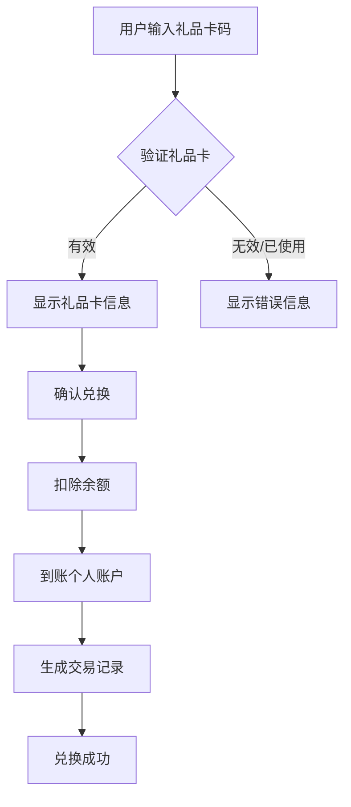
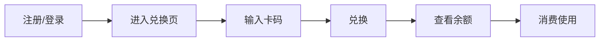

# 礼品卡兑换系统 - 产品需求文档

## 1. 产品概述

礼品卡兑换系统是一款帮助用户在线兑换和管理礼品卡的Web应用。用户可以通过输入礼品卡代码将卡内余额兑换到个人账户，并用于平台内的各种消费场景。

### 目标用户
- 持有礼品卡码的用户
- 希望管理礼品卡余额的用户

### 核心价值
- 简化礼品卡兑换流程
- 安全可靠的余额管理
- 清晰的交易记录

---

## 2. 核心功能

### 2.1 用户角色

| 角色 | 注册方式 | 核心权限 |
|------|----------|----------|
| 普通用户 | 邮箱注册/游客模式 | 兑换礼品卡、管理余额、查看交易记录 |

### 2.2 功能模块

1. **首页**: 礼品卡兑换入口、用户余额展示、最新优惠信息
2. **兑换页面**: 礼品卡码输入、兑换确认、结果反馈
3. **个人中心**: 账户信息、余额明细、交易历史
4. **管理后台** (可选): 礼品卡管理、用户管理、交易统计

---

## 3. 核心流程

### 3.1 礼品卡兑换流程

### 3.2 用户操作流程

---

## 4. 用户界面设计

### 4.1 设计风格

- **主题**: 现代轻奢风格，金色点缀体现礼品卡的高端感
- **主色调**: 深邃藏蓝 #1a1f36 搭配香槟金 #d4af37
- **辅助色**: 纯白 #ffffff、浅灰 #f5f6f8、金色渐变
- **字体**:
  - 标题: Playfair Display (衬线体，优雅高端)
  - 正文: Noto Sans SC (无衬线，清晰易读)
- **按钮风格**: 圆角矩形，金色边框，悬停时带微光效果
- **图标风格**: Lucide Icons，线性风格
- **布局**: 卡片式布局，清晰的信息层级

### 4.2 页面设计概览

| 页面名称 | 模块名称 | UI元素 |
|---------|---------|--------|
| 首页 | 余额卡片 | 半透明玻璃拟态背景，金色数字余额 |
| 首页 | 快速兑换区 | 礼品卡图标 + 输入框 + 兑换按钮 |
| 首页 | 优惠公告 | 横向滚动卡片，金色边框 |
| 兑换页 | 卡码输入 | 大字体输入框，实时格式验证 |
| 兑换页 | 卡券预览 | 礼品卡样式展示，有效期和余额 |
| 个人中心 | 账户信息 | 头像、用户名、会员等级 |
| 个人中心 | 余额明细 | 时间线样式，金色收入/支出标识 |
| 个人中心 | 交易历史 | 表格形式，状态标签 |

### 4.3 响应式设计

- **桌面端**: 三栏布局，沉浸式体验
- **平板端**: 两栏自适应，保留核心功能
- **移动端**: 单栏布局，底部导航，拇指操作优化

---

## 5. 礼品卡规则

### 5.1 礼品卡类型

| 类型 | 面额 | 有效期 |
|------|------|--------|
| 标准卡 | 100/200/500/1000 | 激活后12个月 |
| 纪念卡 | 自定义 | 特殊日期起算 |

### 5.2 兑换规则

- 礼品卡密码为8位字母数字组合
- 每个礼品卡仅可兑换一次
- 兑换后余额立即到账
- 不支持部分兑换，全额兑换

---

## 6. 验收标准

- [ ] 用户可输入礼品卡码并完成兑换
- [ ] 余额实时更新
- [ ] 交易记录完整可查
- [ ] 界面美观，符合设计规范
- [ ] 响应式布局适配多端
- [ ] 错误提示清晰友好
