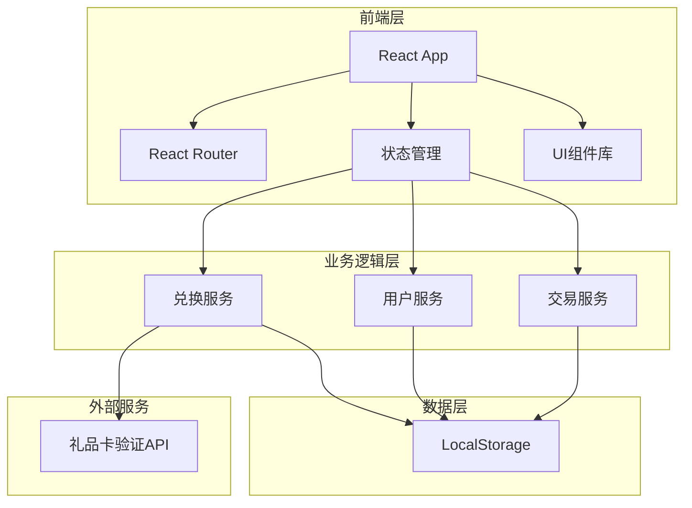

# 礼品卡兑换系统 - 技术架构文档

## 1. 架构设计



**说明**: 本系统采用纯前端架构，使用LocalStorage模拟数据持久化，礼品卡验证通过本地模拟实现。

---

## 2. 技术选型

| 类别 | 技术栈 | 版本 |
|------|--------|------|
| 框架 | React | 18.x |
| 构建工具 | Vite | 5.x |
| 路由 | React Router DOM | 6.x |
| 样式 | Tailwind CSS | 3.x |
| 动画 | Framer Motion | 11.x |
| 图标 | Lucide React | 最新版 |
| 字体 | Google Fonts (Playfair Display, Noto Sans SC) | - |

---

## 3. 路由定义

| 路由 | 页面 | 描述 |
|------|------|------|
| / | HomePage | 首页，展示余额和快速兑换 |
| /redeem | RedeemPage | 礼品卡兑换页 |
| /profile | ProfilePage | 个人中心 |
| /history | HistoryPage | 交易历史 |

---

## 4. 数据模型

### 4.1 用户数据

```typescript
interface User {
  id: string;
  username: string;
  email: string;
  avatar?: string;
  balance: number;
  createdAt: string;
}
```

### 4.2 礼品卡数据

```typescript
interface GiftCard {
  code: string;          // 礼品卡码
  amount: number;        // 面额
  status: 'active' | 'used' | 'expired';
  createdAt: string;
  expiresAt: string;
  usedAt?: string;
  usedBy?: string;
}
```

### 4.3 交易记录

```typescript
interface Transaction {
  id: string;
  type: 'credit' | 'debit';
  amount: number;
  description: string;
  giftCardCode?: string;
  timestamp: string;
  balance: number;      // 交易后余额
}
```

---

## 5. 组件结构

```
src/
├── components/
│   ├── BalanceCard/       # 余额卡片
│   ├── GiftCardInput/     # 礼品卡输入框
│   ├── TransactionItem/    # 交易记录项
│   ├── Navigation/        # 导航组件
│   └── ui/                # 通用UI组件
├── pages/
│   ├── HomePage.tsx
│   ├── RedeemPage.tsx
│   ├── ProfilePage.tsx
│   └── HistoryPage.tsx
├── hooks/
│   ├── useUser.ts
│   ├── useGiftCard.ts
│   └── useTransactions.ts
├── services/
│   ├── storage.ts          # LocalStorage封装
│   ├── giftCard.ts         # 礼品卡验证逻辑
│   └── mockData.ts         # 模拟数据
├── types/
│   └── index.ts
└── App.tsx
```

---

## 6. 模拟数据说明

### 6.1 示例礼品卡

| 卡码 | 面额 | 状态 |
|------|------|------|
| GC2024A | 100 | active |
| GC2024B | 200 | active |
| GC2024C | 500 | used |
| GC2024D | 1000 | active |

### 6.2 初始用户余额

- 默认余额: 0
- 初始交易记录: 空

---

## 7. 核心功能实现

### 7.1 礼品卡验证

```typescript
// 验证规则
// 1. 格式: 8位字母数字组合
// 2. 状态: 必须为 active
// 3. 未过期
// 4. 未被使用
```

### 7.2 兑换流程

1. 用户输入卡码
2. 前端格式校验
3. 查找匹配的礼品卡
4. 验证状态和有效期
5. 更新礼品卡状态为 used
6. 增加用户余额
7. 创建交易记录
8. 页面刷新显示新余额

---

## 8. 状态管理

使用 React Context + useReducer 管理全局状态：

- `UserContext`: 用户信息和余额
- `TransactionContext`: 交易记录列表

---

## 9. 样式规范

### 9.1 颜色变量

```css
:root {
  --color-primary: #1a1f36;
  --color-accent: #d4af37;
  --color-accent-light: #f5e6c0;
  --color-background: #f5f6f8;
  --color-surface: #ffffff;
  --color-text: #1a1f36;
  --color-text-muted: #6b7280;
}
```

### 9.2 间距系统

- 基础单位: 4px
- 组件内间距: 16px / 24px
- 页面边距: 24px (移动端) / 48px (桌面端)

### 9.3 动画规范

- 页面切换: fade + slide, 300ms
- 按钮悬停: scale(1.02), 150ms
- 卡片进入: fadeInUp, staggered 100ms
