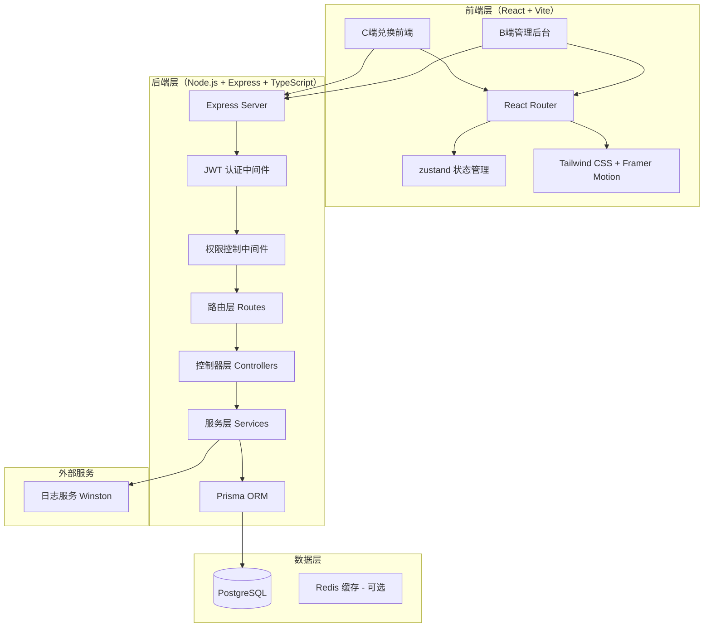

# 礼品卡兑换系统 - 技术架构文档

## 1. 架构设计

本系统采用**前后端分离架构**，确保系统可扩展性与高并发处理能力。



### 架构说明
- **前端**：React 18 + Vite + TypeScript，C端兑换与B端管理后台共用同一 SPA，通过路由区分
- **后端**：Node.js + Express + TypeScript，RESTful API，分层架构（Routes → Controllers → Services → Prisma）
- **数据库**：PostgreSQL，通过 Prisma ORM 访问，支持迁移与类型安全
- **认证**：JWT（JSON Web Token），区分普通用户与管理员权限
- **日志**：Winston 日志记录，支持错误追踪

---

## 2. 技术选型

| 类别 | 技术栈 | 版本 |
|------|--------|------|
| 前端框架 | React | 18.x |
| 构建工具 | Vite | 5.x |
| 路由 | React Router DOM | 6.x |
| 状态管理 | zustand | 5.x |
| 样式 | Tailwind CSS | 3.x |
| 动画 | Framer Motion | 11.x |
| 图标 | Lucide React | 最新版 |
| 字体 | Google Fonts (Playfair Display, Noto Sans SC) | - |
| 后端框架 | Express | 4.x |
| 后端语言 | TypeScript | 5.x |
| ORM | Prisma | 5.x |
| 数据库 | PostgreSQL | 15+ |
| 认证 | JWT (jsonwebtoken) | 9.x |
| 密码加密 | bcryptjs | 2.x |
| 日志 | Winston | 3.x |
| 参数校验 | Zod | 3.x |

---

## 3. 项目结构

```
/workspace
├── src/                        # 前端源码
│   ├── components/             # 通用组件
│   ├── pages/                  # 页面
│   │   ├── client/            # C端兑换页面
│   │   └── admin/             # B端管理后台页面
│   ├── store/                  # zustand 状态管理
│   ├── services/               # API 请求服务
│   ├── hooks/                  # 自定义 hooks
│   ├── types/                  # 类型定义
│   └── App.tsx
├── api/                        # 后端源码
│   ├── src/
│   │   ├── routes/            # 路由定义
│   │   ├── controllers/       # 控制器
│   │   ├── services/          # 业务逻辑层
│   │   ├── middlewares/       # 中间件（认证、权限、错误处理）
│   │   ├── utils/             # 工具函数（日志、JWT等）
│   │   └── app.ts             # Express 应用入口
│   ├── prisma/
│   │   ├── schema.prisma      # 数据库模型定义
│   │   └── seed.ts            # 种子数据
│   └── package.json
├── docker-compose.yml          # PostgreSQL 部署配置
├── .env.example                # 环境变量示例
└── package.json                # 根 package.json（前端）
```

---

## 4. 数据库模型

### 4.1 用户表 (User)
```prisma
model User {
  id        String   @id @default(uuid())
  username  String   @unique
  email     String   @unique
  password  String
  role      Role     @default(USER)
  avatar    String?
  balance   Int      @default(0)
  createdAt DateTime @default(now())
  updatedAt DateTime @updatedAt
  transactions Transaction[]
  orders       Order[]
  addresses    Address[]
  giftCards    GiftCard[]
}

enum Role { USER ADMIN }
```

### 4.2 礼品卡分类 (GiftCardCategory)
```prisma
model GiftCardCategory {
  id          String   @id @default(uuid())
  name        String
  description String?
  icon        String
  sort        Int      @default(0)
  enabled     Boolean  @default(true)
  createdAt   DateTime @default(now())
  templates   GiftCardTemplate[]
  giftCards   GiftCard[]
}
```

### 4.3 礼品卡模板 (GiftCardTemplate) - N选M配置
```prisma
model GiftCardTemplate {
  id                  String   @id @default(uuid())
  name                String
  categoryId         String
  amount              Int
  validDays           Int
  selectCount         Int      // M: 用户必须选择的数量
  maxQuantityPerProduct Int    @default(1)
  createdAt           DateTime @default(now())
  category            GiftCardCategory @relation(fields:[categoryId], references:[id])
  products            TemplateProduct[]
  giftCards           GiftCard[]
}

model TemplateProduct {
  id          String   @id @default(uuid())
  templateId  String
  productId   String
  template    GiftCardTemplate @relation(fields:[templateId], references:[id], onDelete: Cascade)
  product     Product          @relation(fields:[productId], references:[id])
}
```

### 4.4 礼品卡 (GiftCard)
```prisma
model GiftCard {
  id         String   @id @default(uuid())
  code       String   @unique
  amount     Int
  status     CardStatus @default(ACTIVE)
  templateId String
  userId     String?
  createdAt  DateTime @default(now())
  expiresAt  DateTime
  usedAt     DateTime?
  template   GiftCardTemplate @relation(fields:[templateId], references:[id])
  user       User?            @relation(fields:[userId], references:[id])
  orders     Order[]
}

enum CardStatus { ACTIVE USED EXPIRED }
```

### 4.5 商品分类与商品
```prisma
model ProductCategory {
  id        String   @id @default(uuid())
  name      String
  parentId  String?
  icon      String
  sort      Int      @default(0)
  products  Product[]
}

model Product {
  id          String   @id @default(uuid())
  name        String
  categoryId  String
  description String
  image       String
  price       Int
  stock       Int      @default(0)
  status      ProductStatus @default(ON)
  specs       Json?
  createdAt   DateTime @default(now())
  updatedAt   DateTime @updatedAt
  category    ProductCategory @relation(fields:[categoryId], references:[id])
  templateProducts TemplateProduct[]
  orderItems   OrderItem[]
}

enum ProductStatus { ON OFF }
```

### 4.6 订单
```prisma
model Order {
  id              String   @id @default(uuid())
  orderNo         String   @unique
  giftCardId      String
  userId          String
  status          OrderStatus @default(PAID)
  totalAmount     Int
  addressSnapshot Json
  deliveryMethod  Json
  trackingNumber  String?
  logisticsCompany String?
  createdAt       DateTime @default(now())
  updatedAt      DateTime @updatedAt
  giftCard       GiftCard @relation(fields:[giftCardId], references:[id])
  user           User     @relation(fields:[userId], references:[id])
  items          OrderItem[]
}

enum OrderStatus { PAID SHIPPING DELIVERING DELIVERED COMPLETED REFUNDING REFUNDED RETURNING RETURNED }

model OrderItem {
  id          String   @id @default(uuid())
  orderId     String
  productId   String
  productName String
  productImage String
  quantity    Int
  spec        String?
  order       Order   @relation(fields:[orderId], references:[id], onDelete: Cascade)
  product     Product @relation(fields:[productId], references:[id])
}
```

### 4.7 交易记录与收货地址
```prisma
model Transaction {
  id           String   @id @default(uuid())
  userId       String
  type         TransactionType
  amount       Int
  description  String
  giftCardCode String?
  balance      Int
  timestamp    DateTime @default(now())
  user         User     @relation(fields:[userId], references:[id])
}

enum TransactionType { CREDIT DEBIT }

model Address {
  id        String   @id @default(uuid())
  userId    String
  name      String
  phone     String
  province  String
  city      String
  district  String
  detail    String
  isDefault Boolean  @default(false)
  user      User     @relation(fields:[userId], references:[id])
}

model LogisticsCompany {
  id      String  @id @default(uuid())
  name    String
  code    String  @unique
  enabled Boolean @default(true)
}
```

---

## 5. API 接口设计

### 5.1 认证接口
| 方法 | 路径 | 描述 | 权限 |
|------|------|------|------|
| POST | /api/auth/register | 用户注册 | 公开 |
| POST | /api/auth/login | 用户登录 | 公开 |
| GET  | /api/auth/profile | 获取当前用户信息 | 已登录 |

### 5.2 礼品卡接口
| 方法 | 路径 | 描述 | 权限 |
|------|------|------|------|
| POST | /api/gift-cards/validate | 验证礼品卡码 | 已登录 |
| POST | /api/gift-cards/redeem | 兑换礼品卡（N选M） | 已登录 |
| GET  | /api/gift-cards/:code/products | 获取礼品卡可选商品池 | 已登录 |

### 5.3 商品接口
| 方法 | 路径 | 描述 | 权限 |
|------|------|------|------|
| GET  | /api/products | 商品列表 | 公开 |
| GET  | /api/products/:id | 商品详情 | 公开 |
| POST | /api/products | 新增商品 | 管理员 |
| PUT  | /api/products/:id | 编辑商品 | 管理员 |
| DELETE | /api/products/:id | 删除商品 | 管理员 |

### 5.4 订单接口
| 方法 | 路径 | 描述 | 权限 |
|------|------|------|------|
| POST | /api/orders | 创建订单 | 已登录 |
| GET  | /api/orders | 订单列表（用户） | 已登录 |
| GET  | /api/orders/:id | 订单详情 | 已登录 |
| PUT  | /api/orders/:id/status | 更新订单状态 | 管理员 |
| GET  | /api/admin/orders | 全部订单（后台） | 管理员 |

### 5.5 管理后台接口
| 方法 | 路径 | 描述 | 权限 |
|------|------|------|------|
| GET  | /api/admin/dashboard | 仪表盘统计 | 管理员 |
| POST | /api/admin/gift-cards/generate | 批量生成卡码 | 管理员 |
| GET  | /api/admin/gift-cards | 卡码列表 | 管理员 |
| CRUD | /api/admin/categories | 分类管理 | 管理员 |
| CRUD | /api/admin/templates | 模板管理 | 管理员 |
| CRUD | /api/admin/logistics | 物流公司管理 | 管理员 |

---

## 6. 权限控制机制

- **JWT 认证**：登录后签发 token，前端存储于 localStorage，请求头携带 `Authorization: Bearer <token>`
- **角色区分**：`USER`（普通用户）与 `ADMIN`（管理员）两种角色
- **中间件**：`authMiddleware` 校验 token，`adminMiddleware` 校验管理员权限
- **接口保护**：敏感操作（创建/修改/删除）需管理员权限

---

## 7. 状态管理

前端使用 zustand：
- `useAuthStore`：认证状态（用户信息、token、登录登出）
- `useStore`：业务数据（礼品卡、订单、地址等）

---

## 8. 样式规范

### 8.1 颜色变量
```css
:root {
  --color-primary: #1a1f36;
  --color-accent: #d4af37;
  --color-accent-light: #f5e6c0;
  --color-background: #f5f6f8;
  --color-surface: #ffffff;
  --color-success: #10b981;
  --color-warning: #f59e0b;
  --color-danger: #ef4444;
}
```

### 8.2 设计风格
- 主题：现代轻奢商务风，香槟金点缀体现品质感
- 主色调：深邃藏蓝 #1a1f36 搭配香槟金 #d4af37
- 字体：标题 Playfair Display，正文 Noto Sans SC

---

## 9. 部署架构

### 9.1 开发环境
- 前端：`pnpm dev`（Vite dev server，端口 5173）
- 后端：`pnpm dev`（tsx watch，端口 3000，API 前缀 /api）
- 数据库：PostgreSQL（本地或 Docker Compose）
- Vite 配置 proxy 代理 /api 至后端

### 9.2 生产部署
- 前端：`pnpm build` 构建静态资源，Nginx 托管
- 后端：`pnpm build` 编译，PM2 进程管理
- 数据库：PostgreSQL 容器或独立部署
- 提供 `docker-compose.yml` 一键部署
